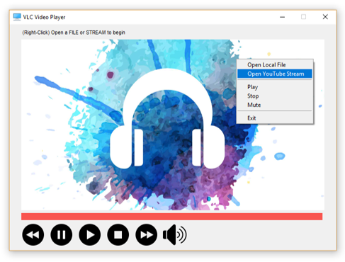
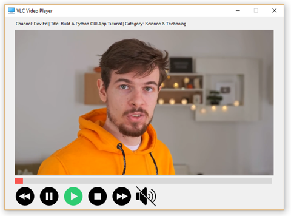

# Media-Player (in progress)
A streaming media player built with PySimpleGUI that will play local music and video files, and also streaming YouTube videos.

  
 


This works on Windows and Linux (as far as I can tell). I don't have a Mac... so if someone else wants to build support for that.. be my guest.  

A screenshot of the program running on a Raspberry Pi 3B+, Python 3.7.  


This is what you'll need for the Linux OS:  
```
sudo pip3 install python-vlc
sudo pip3 install pafy
sudo pip3 install --upgrade youtube-dl
sudo pip3 install --upgrade pysimplegui
sudo apt-get install vlc
```

My source for free icons and buttons:   
https://icons8.com/icon/pack/media-controls/ios-filled

Make sure the VLC install matches the Python version (32/64 bit):  
https://get.videolan.org/vlc/3.0.8/win64/vlc-3.0.8-win64.exe

You may need to upgrade the following library for YouTube streaming:  
`pip install --upgrade youtube-dl`

Source I used for the background image (default.png):  
https://pngtree.com/so/accessory

There's an online tool you can use to encode base64 images:  
https://base64.guru/converter/encode/image/ico  

Here's a demonstration of the python bindings using tkinter:  
https://github.com/oaubert/python-vlc/blob/master/examples/tkvlc.py
