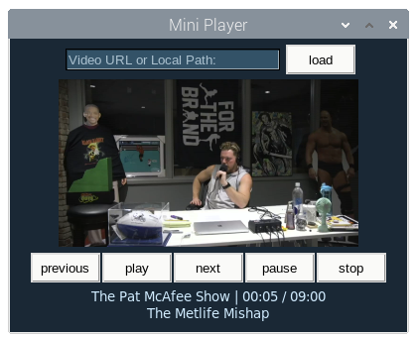
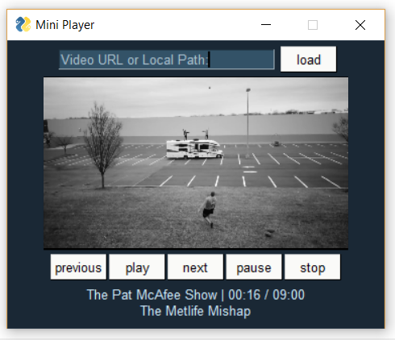
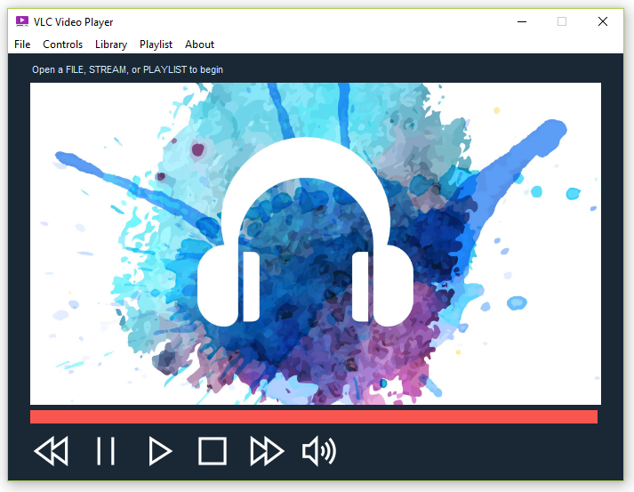
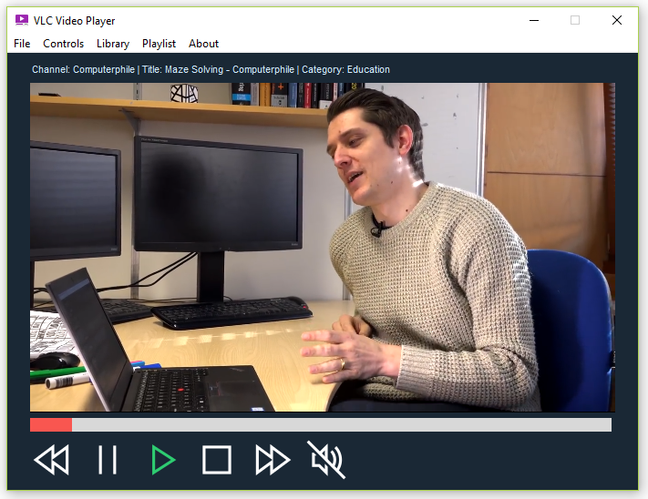
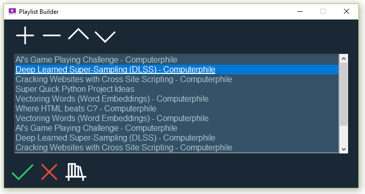
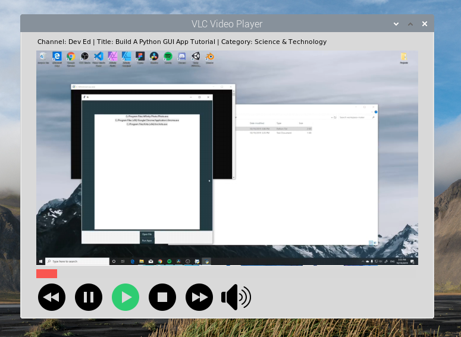

# Media-Player  
Media players built with PySimpleGUI that will play local music and video files, and also streaming YouTube videos.  

There currently two versions of the media-player. A bare-bones **mini-player** and a more full scale **media player** that is still in progress. Both are meant to be 'proof-of-concept' and for instructional purposes and are not meant to be the end-all application with fully implemented error-handling, etc... Please feel free to take this code and customize to your heart's content.  


## Mini-Player
This is a minimalist player that can play both local and online media files (ex. YouTube). Click the LOAD button to load the file or link into a playlist, which you can then traverse with the PREVIOUS and NEXT buttons. This works on both Linux and Windows. Haven't tried Mac, but let me know...  

Getting start with Linux:  
```
sudo pip3 install python-vlc
sudo pip3 install youtube-dl
sudo pip3 install pysimplegui
sudo pip3 install pafy
sudo apt-get install vlc
```

Getting start with Windows:
```
pip install python-vlc
pip install pafy
pip install youtube-dl
pip install pysimplegui
```

On Windows, you also need to download the VLC version that cooresponds to your version of Windows (32/64bit)  
https://get.videolan.org/vlc/3.0.8/win64/vlc-3.0.8-win64.exe  


Here are examples on **Linux** (left) and **Windows** (right)   
 


## Standard Player (in progress)
A fully functional media player that plays both local and streaming media.  

  
 

I'm working on a playlist builder. It currently launches, and works as far as building goes, but it's not yet connected for playing videos.  

 

A screenshot of an ealier version running on a Raspberry Pi 3B+, Python 3.7.  




Getting start with Linux:  
```
sudo pip3 install python-vlc
sudo pip3 install youtube-dl
sudo pip3 install pysimplegui
sudo pip3 install pafy
sudo apt-get install vlc
```

Getting start with Windows:
```
pip install python-vlc
pip install youtube-dl
pip install pysimplegui
pip install pafy
```

On Windows, you also need to download the VLC version that cooresponds to your version of Windows (32/64bit)  
https://get.videolan.org/vlc/3.0.8/win64/vlc-3.0.8-win64.exe  

## Other Resources  

My source for free icons and buttons:   
https://icons8.com/icon/pack/media-controls/ios-filled

Source I used for the background image (default.png):  
https://pngtree.com/so/accessory

There's an online tool you can use to encode base64 images:  
https://base64.guru/converter/encode/image/ico  

Here's a demonstration of the python bindings using tkinter:  
https://github.com/oaubert/python-vlc/blob/master/examples/tkvlc.py
